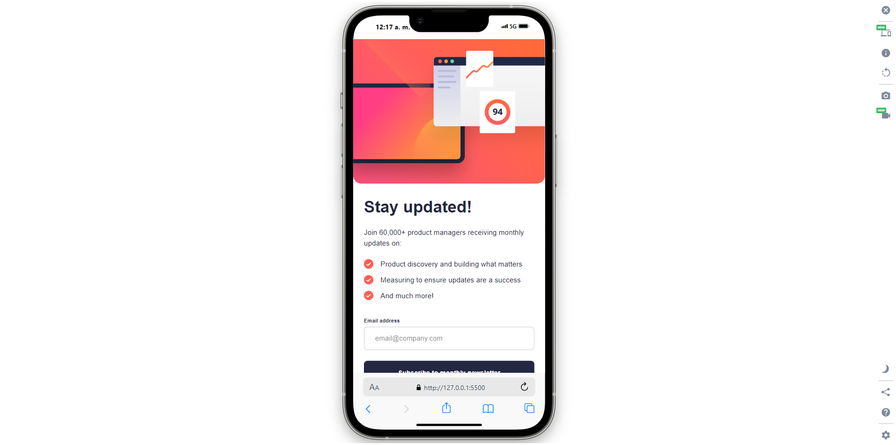

# Formulario de inscripción

_"Este proyecto es una propuesta de solución para uno de los desafios de **Frontend Mentor**, todos los recursos utilizados fueron obtenidos mediante dicha plataforma"._

En este repositorio se presenta un sitio web sobre inscripciones a un boletín informativo, para ello, se pide el ingreso de un correo electrónico. Una vez ingresado el correo electrónico se mostrará un mensaje de éxito.

El diseño del sitio es un tarjeta adaptable a cualquier dispositivo.

## Contenidos

- [Descripción](#descripción)
  - [Desafío](#desafío)
  - [Screenshot](#screenshot)
  - [Links](#links)
- [Proceso](#proceso)
  - [Hecho con](#hecho-con)
  - [Lo que aprendí](#lo-que-aprendí)

## Descripción

### Desafío

El desafío propuesto fue manejar el envio y recibo de formularios en JavaScript, en particular, el envio del correo electrónico es un formulario como tal, la información se envía y se almacena temporalmente.

En la siguiente tarjeta de confirmación, se puede observar como guarda y muestra por pantalla el correo que se ingresó previamente, logrando así manejar lo que se desea mostrar o no en la página.

### Screenshot

#### Escritorio


#### Movil


### Links

- Sitio: [-](#)

## Proceso

### Hecho con

- HTML
- CSS
  - Flexbox
  - CSS
  - Flujo de trabajo _Mobile-first_
- JavaScript

### Lo que aprendí

Como mencioné previamente, lo que aprendí fue el manejo de formularios en JavaScript, con ello pude obtener los (o en este caso el) valores de cada campo, tambien utilicé el atributo ```innerHTML``` para escribir dinamicamente un párrafo incluyendo el correo que extraí.